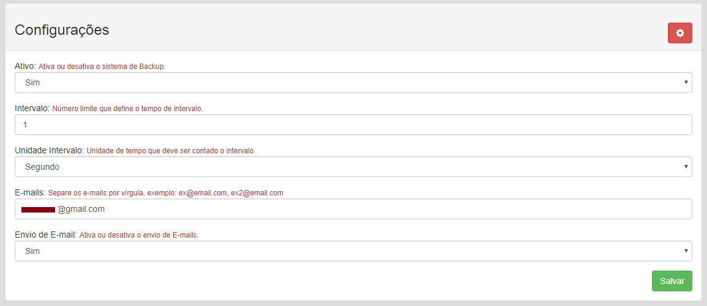

# DumpPHP
 - descrição: Ferramenta para fazer backup de banco de dados MySQL via PHP.
 - Status: Em desenvolvimento;
 
 # Conceito
DumpPHP nasceu de uma necessidade e curiosidade pessoal para criar uma rotina de backup de banco de dados onde o acesso ao usuário fosse fácil e podesse ser acessado de qualquer dispositivo e local, como um pc, note, celular.
Tendo em vista a necessidade e a vontade de aprender, iniciei o levantamento de pesquisas e a produção desta pequena ferramenta para o auxílio em backup de projetos, atualmente a ferramenta encontra-se em desenvolvimento, abaixo listo o que já é possível fazer.

# O que a ferramenta faz hoje?
- O Sistema tem uma interface gráfica feita em BootStrap3;

Aqui temos a tela Principal onde o usuário pode fazer um novo backup, acessar a tela de configurações ou interagir com a grid de backups que já foram realizados, onde ele tem informação da data, que foi realizado, emails que estavam na lista para receber aviso de backup, e pode baixar um arquivo de backup ou deletar.

Por fim temos a tela de configuração, onde o usuário pode habilitar ou não o backup, assim permitindo ou impedindo a realização de novos backups, pode configurar o limite de intervalo entre os backups para que não haja uma realização em massa de backups antes que o tempo de limite seja atingido, pode definir os e-mails que iram receber a informação que o backup foi realizado, e também pode desativar se o sistema deve enviar ou não e-mails.

# O que falta?
Atualmente o DumpPHP não faz backup de Triggers do MySQL, o que deixa o backup incompleto, isso ainda está em desenvolvimento e assim que solucionado será atualzado.

# O que preciso para utilizar o DumpPHP em meus projetos?
Inicialmente é necessário ter conhecimento em PHP, MySQL, para fazer as configurações inciais.

A primeira coisa a fazer é baixar o Dump e adicioná-lo ao seu projeto.

Em seguida, adicionar ao seu banco de dados MySQL as tabelas de configuração que o Dump utiliza, o .sql com as tabelas pode ser encontrado dentro da pasta util.

Feito isso abra o arquivo Conexao.php dentro da pasta util e configure com as informações do banco de dados.

Pronto, está tudo configurado, agora basta acessar via Navegador o diretorio do Dump dentro do seu site e a tela inicial será apresentada.

# Considerações
Desejo a todos que utilizarem a ferramenta sucesso, seja pra uso pessoal, projetos ou acadêmico.
Nos vemos por ai, abraços, e até mais.
